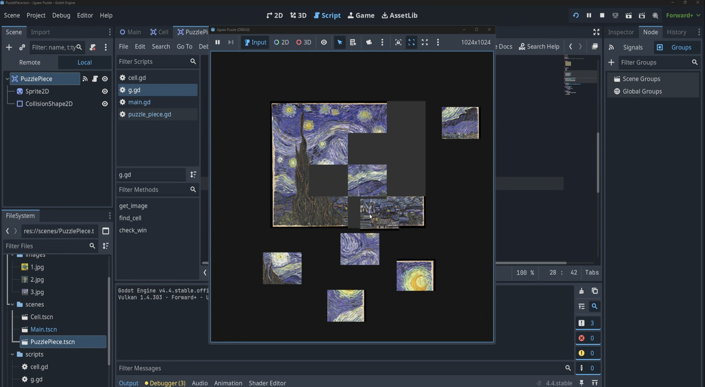

# Jigsaw Puzzle

A 2D Jigsaw Puzzle game where you connect the pieces to uncover classical paintings. This project was created as part of a tutorial series.

## Contributing

Contributions are welcome! If you have ideas or improvements, feel free to fork this repository and open a pull request.

## License

This project is licensed under the MIT License. See the [LICENSE](LICENSE) file for details.
